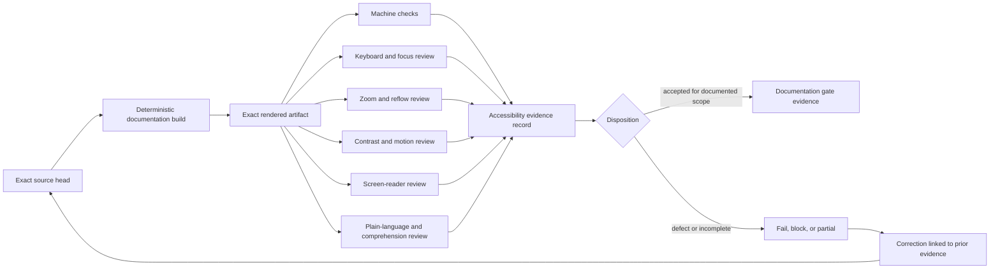

# Accessibility and Review Evidence

## Status

`DOCUMENTED_NOT_CERTIFIED`

This guide defines the review evidence required before this repository's documentation can be described as accessible, current, or publication-ready. It does not certify the current Markdown, rendered MkDocs site, inherited static catalog, ROAPI output, Python API, or any future temporal-invariant interface. It grants no publication, release, deployment, data-access, enforcement, or implementation authority.

The open repository-integrity incident remains release-blocking. Accessibility review may improve documentation quality, but it cannot close the incident, approve repository identity, validate inherited runtime behavior, or authorize a Pages deployment.

## Surfaces reviewed separately

Evidence must identify the exact surface under review. Results from one surface do not transfer automatically to another.

| Surface | Current role | Minimum review boundary |
|---|---|---|
| Source Markdown | Reviewable documentation source | Heading order, link purpose, table structure, code-language labels, diagram alternatives, terminology, and plain-language review |
| Rendered MkDocs site | Candidate static documentation artifact | Keyboard, focus, landmarks, search, zoom/reflow, contrast, reduced motion, responsive tables, generated navigation, and local-asset behavior |
| Generated API reference | Inherited-symbol orientation | Symbol names, signatures, parameter/return descriptions, stability labels, errors, examples, and inherited-versus-local provenance |
| Inherited static catalog | Upstream-derived output | Structure, labels, keyboard use, data-table semantics, filtering, empty/error states, privacy, and remote-asset failure |
| ROAPI configuration/output | Inherited read-only export candidate | Machine-readable contract review plus an accessible human explanation; configuration validity is not accessibility evidence |
| Proposed temporal reports | Design envelope only | Text-equivalent result states, evidence links, uncertainty, correction/revocation status, and no color-only meaning |
| Incident and release evidence | Governance records | Clear status, exact source identity, limitation disclosure, reviewer identity, correction history, and privacy-safe presentation |

## Review-state vocabulary

Every review record uses one of these states:

- **NOT_REVIEWED** — no evidence exists for the exact artifact and environment.
- **PARTIAL** — some checks were completed; omitted checks and impact are listed.
- **PASS** — the named checks passed for the exact artifact, environment, and assistive-technology combination.
- **FAIL** — a reproducible accessibility barrier was found.
- **BLOCKED** — review could not proceed because the artifact, environment, identity, privacy, or incident boundary was unresolved.
- **SUPERSEDED** — a newer exact artifact replaced the reviewed artifact.
- **WITHDRAWN** — the evidence was removed from consideration because its method, identity, or integrity was invalid.
- **CORRECTED** — a defect was repaired and linked to both the failed and replacement evidence generations.
- **UNKNOWN** — evidence is insufficient to determine the state; `UNKNOWN` is never equivalent to `PASS`.

A repository-wide statement such as “accessible” is prohibited unless every claimed surface has exact-artifact evidence and the statement names remaining limitations. Automated checks are supporting evidence only; they are not a substitute for rendered keyboard, zoom/reflow, screen-reader, and comprehension review.

## Evidence flow



**Prose equivalent:** bind review to one immutable source head, produce one deterministic rendered artifact, run machine checks and independent human reviews against that same artifact, combine the results in a signed or attributable evidence record, and either accept only the documented scope or fail closed. A correction starts a new generation and links back to the prior failed or incomplete evidence.

## Required exact-artifact binding

Each evidence record must contain:

- repository and exact source commit;
- pull request and source branch, when applicable;
- build workflow and run identity;
- build command, tool versions, lock or requirements identity, and operating environment;
- rendered artifact name, SHA-256 digest, and retention location;
- review date and reviewer identity or approved reviewer role;
- browser, operating system, viewport, zoom level, color-scheme, and input method;
- assistive technology and version for each manual check;
- checks attempted, checks omitted, results, defects, severity, reproduction steps, and affected routes;
- privacy and sensitive-data review disposition;
- source and evidence correction/supersession links;
- explicit statement that the record grants no release, publication, deployment, data-access, or enforcement authority.

Evidence from a synthetic merge ref, mutable branch name, unrecorded local build, or changed artifact must not be represented as exact-head evidence.

## Source-document requirements

### Structure and navigation

- Use one descriptive page title and a logical heading hierarchy.
- Keep navigation labels distinct, stable, and understandable without surrounding context.
- Provide descriptive link text; avoid unlabeled “here,” raw URLs, and duplicate links with different meanings.
- Use lists for sequences and related items, not visual indentation.
- Give tables a clear introductory sentence and keep headers explicit.
- Keep code blocks labeled with a language where known and explain the purpose and expected outcome.

### Diagrams and cross-modal integrity

- Every Mermaid or other visual diagram requires a prose equivalent that preserves nodes, edges, direction, authority boundaries, status, and limitations.
- Do not encode status, risk, ordering, or authority by color alone.
- Keep terminology and state names identical across diagram, prose, tables, schemas, task chain, release plan, and changelog.
- A diagram may summarize a contract but cannot replace its field, error, migration, and rollback definitions.

### Plain language and cognitive access

- Lead with current status, reader goal, prerequisites, stop conditions, and consequences.
- Expand acronyms on first use and keep a stable term for each concept.
- Separate inherited facts, observed evidence, configuration, proposal, implementation, test result, approval, and blocked work.
- State uncertainty and missing evidence directly.
- Break long procedures into ordered steps with expected results and recovery actions.
- Avoid implying compromise, safety, compatibility, certification, or approval without accepted evidence.

## Rendered-site review protocol

### Keyboard and focus

Review every navigation path, search control, disclosure, tab, code-copy control, anchor link, and interactive component using the keyboard alone.

Required evidence includes:

- logical focus order;
- visible focus at every step;
- no keyboard trap;
- ability to bypass repeated navigation;
- usable current-page indication that is not color-only;
- no hidden control receiving focus;
- recovery when search returns no result or an error.

### Zoom, reflow, and low-vision review

Review at 200% and 400% zoom and at narrow responsive widths. Text, navigation, tables, code, diagrams, callouts, and status labels must remain readable without loss of information or two-dimensional scrolling except where intrinsically necessary. Any necessary horizontal scrolling must be localized to the component and explained.

### Contrast, color, and motion

- Test text, icons, focus indicators, links, status labels, code highlighting, and diagrams in every supported palette.
- Preserve status and graph meaning without color.
- Respect reduced-motion preferences; essential motion must have a non-motion equivalent.
- Treat third-party theme defaults as unverified until tested against the exact rendered artifact.

### Screen-reader review

At minimum, review headings, landmarks, navigation, search, page title, link names, lists, tables, code blocks, admonitions, footnotes, and image/diagram alternatives. Generated API content must announce symbol names, signatures, parameter groups, return values, exceptions, stability, and inheritance in a coherent order.

### Privacy and failure behavior

The rendered site must not expose credentials, private paths, account identifiers, unredacted remotes, sensitive catalog samples, source URIs, or incident evidence beyond the approved public boundary. Missing local assets, blocked remote assets, absent generated API content, empty navigation sections, and unavailable optional inherited catalog files must fail legibly rather than producing misleading blank or broken content.

## Temporal-result communication requirements

Any future temporal result or report must provide text-equivalent fields for:

- `pass`, `fail`, `indeterminate`, `error`, and `rejected`;
- applicable contract and observation identity;
- time model, window, ordering assumptions, and evidence coverage;
- uncertainty, missing evidence, and unsupported semantics;
- correction, revocation, supersession, and retention state;
- whether the result is evidence, advice, or an authorized decision.

`indeterminate`, `error`, `rejected`, `unknown`, `partial`, or stale evidence may never be visually or semantically collapsed into `pass`.

## Review record template

```yaml
schema: datarepo-accessibility-review/v1
repository: aevespers2/datarepo-temporal-invariants
source_commit: <40-hex commit>
source_branch: <branch>
pull_request: <number-or-null>
build:
  workflow: <workflow name>
  run_id: <run id>
  command: <exact command>
  environment: <runner and tool versions>
artifact:
  name: <artifact name>
  sha256: <64-hex digest>
  location: <retained evidence location>
review:
  state: NOT_REVIEWED | PARTIAL | PASS | FAIL | BLOCKED | SUPERSEDED | WITHDRAWN | CORRECTED | UNKNOWN
  date: <RFC 3339 timestamp>
  reviewer: <approved identity or role>
  surfaces: [source-markdown, rendered-mkdocs]
  browsers: []
  assistive_technology: []
  viewports: []
  checks_completed: []
  checks_omitted: []
  defects: []
  limitations: []
privacy:
  state: NOT_REVIEWED | PARTIAL | PASS | FAIL | BLOCKED
  notes: []
links:
  prior_evidence: []
  corrections: []
  supersedes: []
authority:
  publication_authorized: false
  release_authorized: false
  deployment_authorized: false
  data_access_authorized: false
  enforcement_authorized: false
```

The template is documentation-only. It is not a schema accepted for automation, attestation, certification, publication, or release.

## Fail-closed stop conditions

Stop documentation acceptance and mark the record `FAIL` or `BLOCKED` when:

- source, workflow, artifact, or digest identity is missing or inconsistent;
- a diagram lacks an equivalent explanation;
- keyboard focus is lost, hidden, trapped, or illogical;
- content or controls disappear at required zoom/reflow conditions;
- status or authority depends on color alone;
- an automated check is presented as complete accessibility certification;
- inherited, proposed, implemented, tested, verified, and approved states are conflated;
- generated API documentation contradicts the exact source;
- sensitive or private information crosses the approved publication boundary;
- a corrected or revoked result remains presented as current;
- the open integrity incident prevents trustworthy source or artifact attribution.

## Reviewer onboarding sequence

1. Read the [project guide](project-guide.md), [repository-integrity operations](repository-integrity.md), and [authority and claims](authority-and-claims.md).
2. Confirm the exact source head and current incident/release state.
3. Build without package publication, Pages deployment, credential use, remote data access, or custom table execution.
4. Retain and hash the exact rendered artifact.
5. Complete machine and manual reviews against that artifact.
6. Record omitted checks and limitations rather than inferring success.
7. Link defects to a correction generation and preserve prior evidence.
8. Keep publication, release, deployment, and implementation decisions in their separate approval gates.

## Acceptance boundary

This guide improves documentation readiness only. A future documentation acceptance requires an exact-head build, local-link and generated-output review, diagram/prose consistency, keyboard and focus review, zoom/reflow testing, contrast and reduced-motion review, screen-reader testing, privacy review, retained evidence, and explicit approval. The repository-integrity incident, identity decision, inherited baseline, temporal contracts, gluing witnesses, release, and deployment remain separate blocked gates.