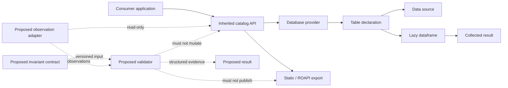
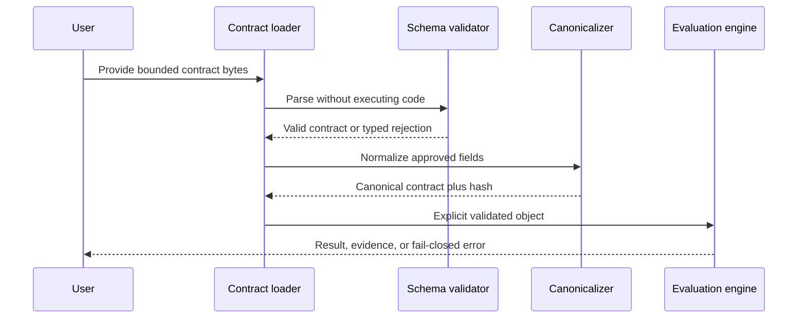

# API and Extension Boundaries

## Status

This page documents the inherited API surface and the review boundary for a possible future temporal-invariant extension. It does not establish a new public API, compatibility promise, package namespace, or implementation schedule.

The inherited package remains `data-repository` 0.0.2. Local reproduction and support claims remain blocked until the integrity incident is closed, repository identity is approved, and the inherited baseline is verified at an immutable commit.

## Inherited API map

The package documentation and source describe the following conceptual entry points:

| Area | Representative entry points | Responsibility | Current classification |
|---|---|---|---|
| Catalog | `Catalog` | Groups named databases and provides discovery | Inherited |
| Database | `ModuleDatabase` and compatible database providers | Resolves named tables | Inherited |
| Table declarations | `DeltalakeTable`, `ParquetTable`, `table` | Declares source, schema, metadata, filters, and partitions | Inherited |
| Query expressions | `Filter`, partition objects, table selection | Expresses bounded reads and predicates | Inherited |
| Lazy query interface | `NlkDataFrame` and Polars lazy operations | Composes data transformations before collection | Inherited |
| Static export | `export_and_generate_site` | Generates a static catalog representation | Inherited |
| Read-only API export | `datarepo.export.roapi.export_to_roapi_table` and `export_to_roapi_tables` | Generates ROAPI table configuration records | Inherited |

Names are recorded here for orientation only. The exact accepted surface must be generated from the immutable source candidate after P2 baseline reproduction.

## Responsibility boundaries

Solid edges represent the inherited conceptual flow. Dashed edges represent a design envelope only.

## Stability classes

A future maintained derivative should classify every public symbol before promising compatibility:

- **Public inherited API** — documented upstream entry points intended for consumers.
- **Inherited implementation detail** — source that may change without compatibility guarantees.
- **Local governance API** — schemas or records used only for release, evidence, or incident handling.
- **Proposed overlay API** — review artifacts with no implementation or stability promise.
- **Experimental extension** — executable behavior, if later approved, isolated behind an explicit namespace and version.

No local document may silently promote an inherited implementation detail or proposed overlay shape into a supported public API.

## Proposed extension principles

Any temporal extension must be:

1. **Additive** — it consumes explicit declarations or observations without rewriting inherited classes.
2. **Versioned** — contracts, results, evidence manifests, and adapters identify schema and semantic versions.
3. **Deterministic** — identical canonical inputs produce identical semantic outputs and hashes.
4. **Read-only by default** — validation does not mutate source data, catalogs, package metadata, or exports.
5. **Bounded** — input size, recursion, evaluation time, memory, decompression, and external access are constrained.
6. **Evidence-producing** — results retain sufficient provenance for replay without copying secrets.
7. **Reversible** — removal of the overlay restores the exact inherited baseline.
8. **Fail-closed** — unsupported versions, ambiguous ordering, missing required evidence, or canonicalization failure do not become a pass.

## Candidate extension points

The following extension points may be evaluated after P3 approval:

| Extension point | Input | Output | Required guardrail |
|---|---|---|---|
| Catalog observation adapter | Catalog/database/table metadata | Canonical observation record | No arbitrary code execution during contract parsing |
| Schema snapshot adapter | Declared or observed schema | Canonical schema observation | Stable type and metadata normalization |
| Partition observation adapter | Partition identity and metadata | Ordered or partially ordered observations | Explicit clock and ordering model |
| Artifact adapter | Immutable artifact reference and digest | Artifact observation | Path/URI normalization and bounded reads |
| Contract loader | Versioned declarative contract | Validated contract object | Reject unknown required fields and unsupported majors |
| Validation engine | Contract plus observations | Structured result | Deterministic resource-bounded evaluation |
| Evidence writer | Result plus provenance | Manifest and hashes | No secrets; atomic output; explicit destination |
| Report renderer | Structured result | Human-readable report | Treat content as untrusted; escape output |

These are candidates, not accepted interfaces.

## Forbidden implicit integrations

The first overlay implementation, if approved, must not implicitly:

- monkey-patch inherited classes;
- alter table read or filter semantics;
- collect data during import;
- start a service, scheduler, hook, or background worker;
- write into source repositories or tracked forensic paths;
- enable network access merely by loading a contract;
- execute arbitrary Python predicates from untrusted contracts;
- publish static sites, APIs, packages, or results;
- enforce deployment or mutate data based on a validation result;
- claim compatibility with untested upstream versions.

## Candidate namespace model

A namespace decision remains open. Review should compare at least:

- a separate package with explicit adapter dependency;
- a local subpackage in a renamed derivative;
- a documentation-only schema repository;
- a CLI package that consumes exported observations;
- integration into catalog export only after compatibility proof.

The chosen namespace must preserve upstream attribution, avoid package-name collision, identify ownership, and support removal without changing inherited imports.

## Contract-loading boundary

Contract loading should be data-only:

No import hook, dynamic module execution, remote fetch, or environment-variable expansion is implied.

## Error and result separation

A future API should keep these outcomes distinct:

- **pass** — the predicate was evaluated and held under the declared model;
- **fail** — the predicate was evaluated and did not hold;
- **indeterminate** — required evidence, ordering, or supported semantics were insufficient;
- **error** — parsing, canonicalization, resource, adapter, or execution failure prevented evaluation;
- **rejected** — the contract or observation was invalid or unsupported before evaluation.

`indeterminate`, `error`, and `rejected` may never be coerced to `pass`.

## Compatibility questions requiring approval

Before implementation, decide:

- which inherited upstream commit or release is the compatibility baseline;
- whether catalog classes are consumed directly or through serialized observations;
- which Python and dependency versions are supported;
- whether extension adapters are public API or internal integration points;
- how contract and result schema versions map to engine versions;
- what constitutes semantic compatibility across engine upgrades;
- whether custom predicates are prohibited or allowed only as signed/reviewed extensions;
- which failures are retryable, release-blocking, or advisory;
- how evidence generated by older versions is replayed;
- how the overlay is disabled or removed.

## Documentation obligations for an implementation PR

Any future implementation PR must update:

- the exact generated API reference;
- the approved architecture decision records;
- contract and result schemas;
- canonicalization rules;
- compatibility and migration tables;
- positive, negative, adversarial, and replay fixtures;
- threat model and resource bounds;
- release evidence and rollback instructions;
- `taskchain.md`, `release.md`, and `changelog.md`.

Until those records exist and P3 is marked `READY`, this page remains a boundary document rather than an implementation specification.
