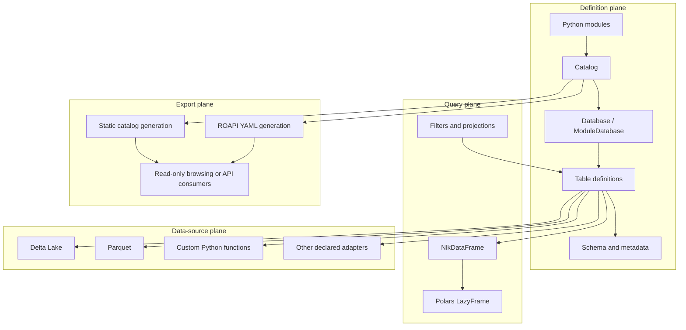
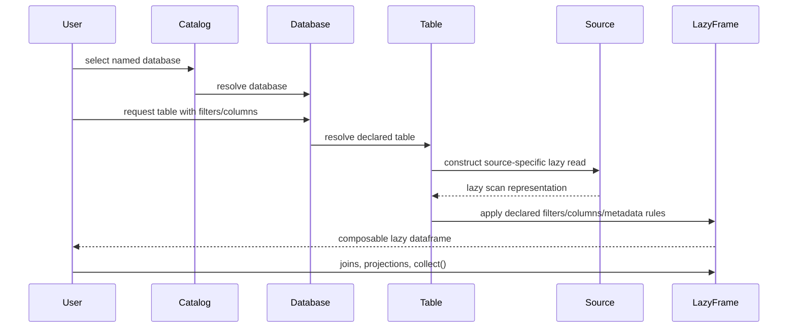
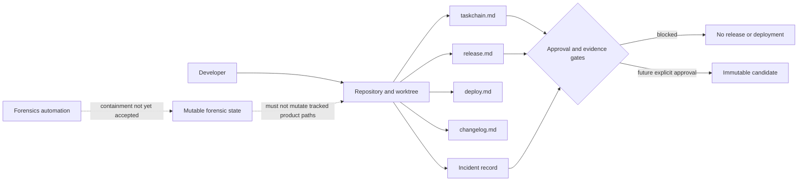
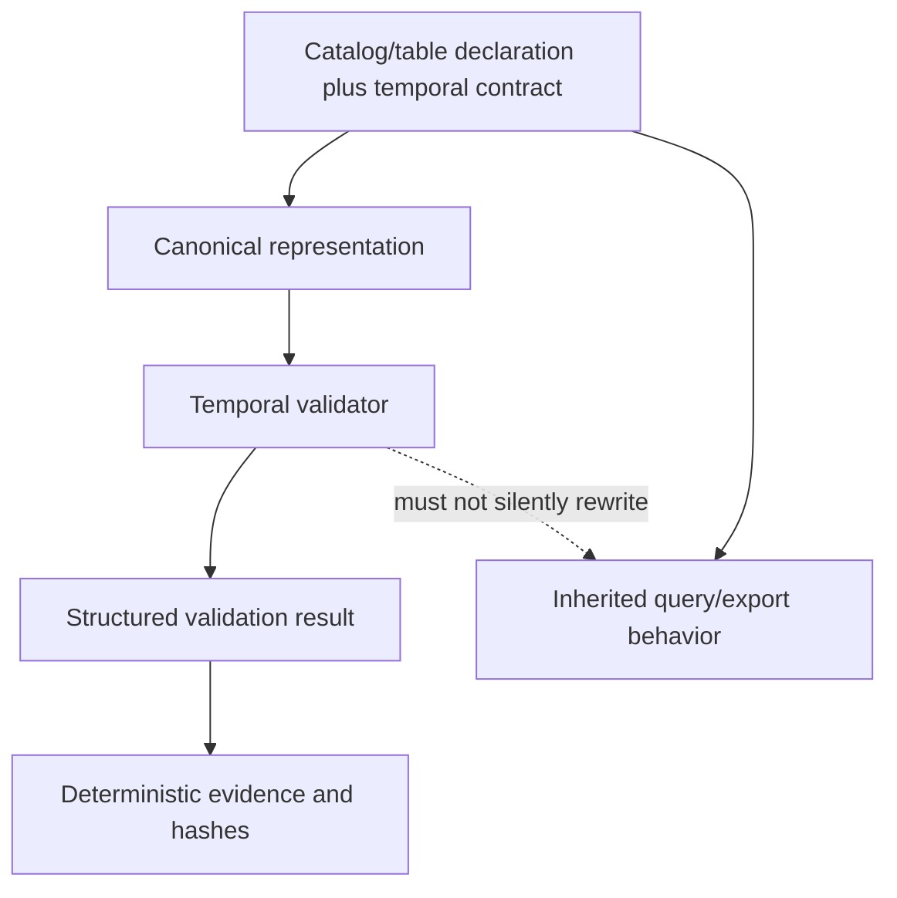

# Architecture and Trust Boundaries

## Scope of this document

This document separates three concerns that must not be conflated:

1. the inherited `datarepo` package architecture;
2. local repository-integrity and release controls;
3. a proposed temporal-invariant overlay that has not been approved or implemented.

The diagrams describe interfaces and control boundaries. They do not certify that the current repository builds, tests, publishes, or operates safely.

## Inherited package architecture

### Architectural characteristics

- **Code-defined catalog:** catalog and table definitions live in Python rather than a required long-running control service.
- **Lazy query composition:** table access returns a lazy dataframe abstraction so filtering, selection, joining, and collection can be composed.
- **Source adapters:** Delta Lake, Parquet, and custom Python functions are exposed through a common table boundary.
- **Static/read-only export:** the package can generate catalog documentation and configuration for a read-only API path.
- **Local-first operation:** the design favors composable libraries and generated artifacts over mandatory distributed infrastructure.

## Primary runtime sequence

## Repository control architecture

The local repository adds planning and evidence controls around the inherited code. These controls are not part of the upstream package API.

The automation is **not** classified as contained until a preserved containment record, writer identity, invocation path, and independent replay have been accepted. The incident remains open and release-blocking.

## Trust zones

| Zone | Examples | Trust assumption | Required control |
|---|---|---|---|
| Inherited source | package code and upstream-oriented docs | Must be attributed and reproduced, not presumed correct | exact baseline, license/notices, divergence report, tests |
| Local planning | task chain, release, deployment, changelog | Describes intent and gates, not implementation truth | cross-file consistency and evidence links |
| Local mutable state | forensic epochs, locks, runtime logs | Untrusted unless writer and scope are explicit | out-of-tree storage, exclusive locks, atomic writes, ownership/path checks |
| Data sources | S3, Delta Lake, Parquet, custom functions | May contain sensitive, malformed, stale, or adversarial data | least privilege, schema checks, bounded reads, error isolation |
| Generated artifacts | static site, ROAPI config, wheels, reports | Must be tied to one immutable input commit and environment | checksums, SBOM, provenance, deterministic generation |
| Publication endpoints | GitHub Pages, package registry, downstream consumers | Remote write boundary | explicit approval, scoped credentials, exact-head CI, rollback |

## Data and security boundaries

### Data-source boundary

Table definitions may point to local files, object storage, or custom functions. Documentation examples are illustrative and do not authorize access to any real data source. A production profile would need explicit credential handling, network policy, data classification, redaction, retention, and query-cost constraints.

### Custom-function boundary

Custom Python table functions are executable code, not passive schema declarations. Treat them as trusted application code. Do not execute unreviewed catalog modules merely to render documentation or inspect metadata.

### Static-site boundary

A generated catalog can expose schemas, samples, metadata, filters, source locations, or operational descriptions. Publication must include a privacy review and must avoid embedding credentials, private endpoints, regulated data, or sensitive examples.

### ROAPI boundary

Generated configuration is an integration artifact, not an authorization system. Authentication, network exposure, rate limiting, query limits, logging, and data-level access remain responsibilities of the deployment environment.

### Build-hook boundary

The package uses a custom Hatch build hook for static-site assets. Build hooks execute during packaging and therefore belong to the supply-chain trust boundary. Reproducible builds require reviewing the hook, its subprocesses, its dependency resolution, generated assets, and network behavior.

## Proposed overlay placement

A future overlay should be additive and separately versioned. It should validate declared temporal claims and emit structured results rather than silently modifying source reads, query plans, or inherited table behavior.

## Failure and stop conditions

Stop and preserve evidence when:

- repository or worktree identity is ambiguous;
- mutable state appears in tracked product paths;
- a hook, scheduler, script, or process writes without explicit authorization;
- build or documentation generation requires unreviewed network access;
- inherited and local code cannot be distinguished;
- generated outputs differ for the same declared inputs and environment;
- data-source credentials, private endpoints, or sensitive samples appear in artifacts;
- temporal semantics are underspecified or compatibility impact is unknown;
- rollback cannot restore a reviewed immutable baseline.

## Architectural decisions still required

- repository identity and ownership model;
- exact upstream commit and divergence policy;
- supported Python and dependency matrix;
- whether GitHub Pages will represent upstream docs, a maintained fork, or a separate overlay;
- temporal time model, canonicalization rules, result schema, compatibility policy, and migration mechanism;
- credential and privacy model for rendered catalogs and read-only APIs;
- artifact signing, provenance, release authority, and support ownership.
