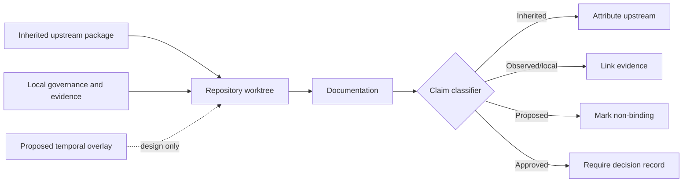

# Authority and Claims Governance

## Purpose

This guide defines how documentation in `datarepo-temporal-invariants` distinguishes inherited facts, local evidence, proposed architecture, verified results, and release approval. It prevents a planning document, generated page, or copied upstream statement from being interpreted as authority the repository does not have.

The governing principle is simple:

> Every capability claim must identify its source, maturity, evidence, and authority boundary.

## Claim classes

| Class | Meaning | Permitted wording | Required evidence |
|---|---|---|---|
| **Inherited** | Behavior, metadata, examples, or interfaces copied from the upstream `data-repository` 0.0.2 baseline | “The inherited package defines…” | Exact upstream provenance and retained source/documentation |
| **Observed** | A local fact directly preserved from repository state, logs, files, or commands | “The preserved record shows…” | Immutable artifact, hash, command transcript, or reviewed incident record |
| **Configured** | A setting exists in source or configuration, but runtime behavior is not established | “The candidate configures…” | Exact file and commit |
| **Implemented** | Code exists for the named behavior | “The code contains…” | Exact commit and implementation path |
| **Tested** | A defined test passed at an immutable commit | “The test suite passed…” | Command, environment, result, commit, and retained report |
| **Verified** | Independent review reproduced the result and checked its evidence chain | “Independent validation confirmed…” | Reviewer record, replay commands, hashes, and immutable commit |
| **Approved** | The Architect or designated release authority accepted the decision or artifact | “Approved for…” | Explicit decision record or approval event |
| **Proposed** | A design, contract, schema, workflow, or product direction is under review | “The proposed overlay would…” | Reviewable design document; no runtime implication |
| **Blocked** | A capability or release action may not proceed because a prerequisite is unmet | “Publication remains blocked…” | `taskchain.md`, `release.md`, or incident gate |

A statement may use more than one class only when each class is explicit. For example, “An inherited API is present, but its behavior has not been reproduced locally” is preferable to “The API is supported.”

## Sources of truth

The repository uses the following precedence order:

1. **Immutable evidence and accepted incident records** for repository-integrity facts.
2. **`taskchain.md`** for sequencing, ownership, dependencies, and readiness state.
3. **`release.md`** for release eligibility, evidence gates, artifact requirements, and rollback criteria.
4. **Approved architecture decision records** for durable design choices.
5. **Exact source and tests** for implemented behavior.
6. **`changelog.md`** for the historical record of material changes.
7. **GitHub Pages and project guides** for explanatory summaries.

Pages content must summarize the higher-authority records; it must not supersede them.

## Repository identity boundary

The repository currently contains three distinct categories of material:

Until the repository-identity decision is approved, documentation must not:

- present this repository as the canonical upstream project;
- claim a maintained fork release;
- publish under the inherited package name;
- imply that the temporal overlay exists as executable software;
- remove or obscure upstream attribution;
- treat local governance files as upstream policy.

## Capability-status vocabulary

Use these status labels consistently in tables and diagrams:

- `PRESENT` — the artifact exists.
- `INHERITED` — the artifact or behavior is from the upstream baseline.
- `PROPOSED` — documented for review only.
- `BLOCKED` — prohibited pending named prerequisites.
- `NO CURRENT EVIDENCE` — the repository lacks accepted current proof.
- `PARTIAL` — some evidence exists, but acceptance criteria are incomplete.
- `PASS` — an acceptance gate passed at a named immutable candidate.
- `FAIL` — an acceptance gate is unmet or contradicted.
- `PENDING` — an explicit human decision remains outstanding.

Avoid ambiguous labels such as “done,” “supported,” “secure,” “production-ready,” or “complete” unless the corresponding acceptance criteria and authority are named.

## Documentation update matrix

| Change | Required documentation review |
|---|---|
| Upstream baseline changes | Project guide, provenance record, inherited API guide, compatibility notes, changelog |
| Repository-identity decision | ADR-0001, MkDocs metadata, README/Pages identity, release plan, notices, package naming |
| Integrity-incident evidence | Incident record, integrity operations guide, release gates, task chain, changelog |
| Incident containment or repair | Threat model, operations, fixtures, independent validation, rollback, release evidence |
| Temporal contract proposal | Overlay design, API/extension boundary, fixture plan, compatibility, ADR-0002 |
| Executable overlay implementation | Source/API reference, tests, security model, migration, release evidence, changelog |
| Pages publication | Site identity, privacy review, link validation, artifact digest, deployment record, rollback |
| Package publication | Release plan, exact artifacts, SBOM, checksums, provenance, approvals, migration |

## Diagram rules

Diagrams must distinguish maturity visually and textually:

- solid edges describe inherited or implemented relationships;
- dashed edges describe proposed relationships;
- red or warning labels may identify blocked paths, but color must not be the only indicator;
- every diagram must include nearby prose explaining what is and is not implemented;
- diagrams may not imply network, write, enforcement, or publication authority absent from the repository.

## Evidence references

A strong evidence reference includes:

- repository and immutable commit;
- command or workflow identifier;
- environment and dependency facts needed for replay;
- artifact name and SHA-256 digest;
- result status and relevant logs;
- reviewer or approval identity;
- known limitations and residual risk.

A branch name, screenshot, mutable file, or narrative assertion alone is not sufficient release evidence.

## Incident language

The open forensic-state issue is a **suspected repository-integrity incident**. Documentation may accurately record observed marker drift, reported writer paths, worktree behavior, and preserved evidence. It must not assign malicious intent, identify an actor, or claim compromise without independently validated evidence.

Preferred language:

- “The preserved record shows an unexplained tracked-state change.”
- “The writer and invocation path remain under investigation.”
- “Benign and adversarial hypotheses remain open.”

Prohibited language without proof:

- “The repository was hacked.”
- “A named actor changed the file.”
- “The automation is safe.”
- “The incident is closed.”

## Publication review checklist

Before any documentation deployment, reviewers must confirm:

- repository identity and ownership are approved;
- inherited branding and links are not presented as local release authority;
- every major capability claim has a maturity label;
- proposed temporal behavior is clearly non-executable;
- incident details do not expose secrets or overstate causation;
- generated API pages match the exact accepted source commit;
- external links, diagrams, code examples, and navigation build successfully;
- privacy, accessibility, license, notices, provenance, artifact digest, and rollback evidence are retained;
- `release.md` and `deploy.md` authorize the publication action.

## Review stop conditions

Stop documentation publication and return the candidate to review if:

- site metadata points to an unapproved repository or package identity;
- a proposed contract is described as implemented;
- an inherited capability is described as locally verified without evidence;
- incident claims exceed preserved evidence;
- exact-head build or link validation is missing;
- pages contain credentials, private endpoints, sensitive rows, or unreviewed forensic material;
- the documentation contradicts `taskchain.md`, `release.md`, an accepted ADR, or the changelog.
