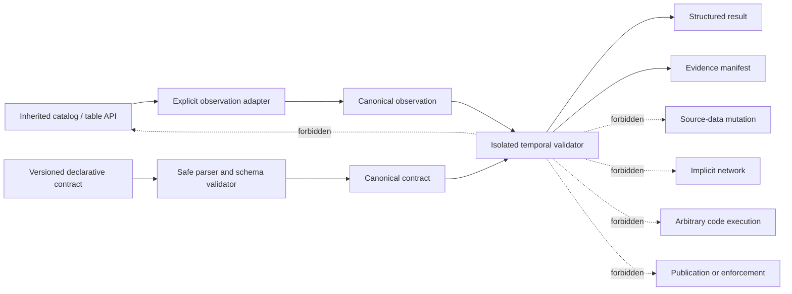

# ADR-0002: Isolate Temporal Validation from Inherited Query Behavior

- **Status:** Proposed — not implementation authority
- **Date:** 2026-07-19
- **Decision owner:** Architect
- **Depends on:** ADR-0001 and `taskchain.md` P3 readiness

## Context

The repository is evaluating a schema-first temporal-invariant capability that could validate claims about schemas, records, partitions, artifacts, or derived state across time. The inherited package already defines catalog, database, table, lazy-query, static-export, and ROAPI-oriented behavior.

Adding validation directly inside inherited query classes would create several risks:

- silent changes to existing reads, filters, collection, or export behavior;
- unclear package and compatibility ownership;
- implicit data access or mutation during normal queries;
- non-deterministic results caused by environment, clock, or network state;
- inability to remove the overlay cleanly;
- confusion between validation evidence and enforcement authority;
- broader security exposure to untrusted contracts or metadata.

## Decision drivers

- Preserve inherited semantics until explicitly approved otherwise.
- Make temporal contracts versioned, reviewable, and independently testable.
- Keep validation deterministic and offline-capable.
- Treat contracts, metadata, and observations as untrusted inputs.
- Prevent implicit network access, code execution, writes, or publication.
- Retain sufficient provenance for independent replay.
- Support clean rollback to the inherited baseline.
- Permit future adapters without making them mandatory for ordinary package use.

## Proposed decision

If executable temporal validation is approved, implement it as an **explicit, additive overlay** separated from inherited query execution by versioned observation adapters.

The overlay should receive:

1. a validated, declarative invariant contract;
2. one or more canonical observation records produced through explicit adapters;
3. bounded evaluation configuration;
4. explicit evidence-output configuration.

It should return a structured result and evidence manifest without mutating catalogs, data sources, query plans, source repositories, or publication targets.

Dashed forbidden edges are architectural constraints, not implemented controls.

## Required boundary properties

### Explicit invocation

Validation occurs only through a clearly named API or CLI entry point. Importing the inherited package, defining a table, collecting a lazy frame, or generating a site must not trigger temporal validation.

### Data-only contracts

Contracts use a versioned declarative format. Parsing must not import modules, evaluate Python, expand shell expressions, invoke plugins, or fetch remote content.

### Observation adapters

Adapters translate approved inherited objects or serialized artifacts into canonical observations. Adapters must declare:

- supported subject type and inherited baseline;
- data and metadata accessed;
- clock and ordering source;
- resource bounds;
- network and credential requirements;
- redaction behavior;
- deterministic fields and excluded environment facts.

### No implicit mutation

The validator does not:

- write source data;
- alter schemas or partitions;
- modify catalog/table objects;
- update query plans;
- commit repository files;
- write mutable state to tracked forensic paths;
- publish reports, packages, APIs, or sites;
- enforce a deployment or business action.

Evidence output requires an explicit destination and atomic, path-safe write behavior.

### Fail-closed semantics

Unsupported versions, malformed contracts, ambiguous timestamps, unresolved ordering, missing required evidence, canonicalization failure, resource exhaustion, and adapter failure remain distinguishable from `pass`.

### Deterministic core

The semantic core should be a pure or effectively pure transformation from canonical contract plus canonical observations plus declared evaluation configuration to structured result. Wall-clock timestamps, host paths, random identifiers, network responses, and environment-specific values must not alter semantic hashes unless explicitly included by contract.

### Enforcement separation

A validation result is evidence. A separate, explicitly authorized system may later consume that evidence. The validator itself has no deployment, payment, access-control, deletion, or remediation authority.

## Packaging options

The final package layout depends on ADR-0001. Acceptable patterns may include:

- a separate package depending on a stable inherited public API;
- a CLI consuming serialized observations;
- a documentation/schema package with independent validator implementations;
- a subpackage in an approved renamed derivative, provided imports remain opt-in.

Embedding validation invisibly into inherited classes is not an acceptable default.

## Interface envelope

A future implementation should expose conceptually separate interfaces:

| Interface | Responsibility |
|---|---|
| Contract parser | Decode bounded bytes and reject unsupported or malformed structures |
| Contract validator | Enforce schema and semantic prerequisites before evaluation |
| Canonicalizer | Produce deterministic representation and digest |
| Observation adapter | Produce bounded canonical observations from an explicit source |
| Validation engine | Evaluate approved predicates under declared time/order semantics |
| Result serializer | Emit versioned structured result |
| Evidence builder | Bind source, contract, environment, engine, artifacts, and hashes |
| Report renderer | Create escaped human-readable output from structured results |

These interfaces remain candidates until schemas and fixtures are approved.

## Security requirements

- Bound bytes, object count, nesting, string length, regex complexity, decompression, memory, and execution time.
- Reject path traversal, unsafe symlinks, unsupported URI schemes, and unauthorized owners.
- Disable network access by default.
- Never retain credentials or secret values in evidence.
- Escape untrusted content in HTML and terminal output.
- Avoid dynamic imports and plugin discovery from untrusted paths.
- Make adapter privileges visible and least-privilege.
- Record engine, schema, adapter, and dependency versions for replay.
- Keep evidence writes atomic and separate from tracked live-worktree state.

## Compatibility requirements

Compatibility must be evaluated independently for:

- contract schema;
- result schema;
- engine semantics;
- observation adapter behavior;
- inherited baseline;
- evidence manifest;
- report rendering.

A parser being able to load an older contract does not prove semantic compatibility. Breaking semantic changes require a major version and migration/replay evidence.

## Required fixtures

Before implementation is accepted, retain deterministic fixtures for:

- minimal pass and fail cases;
- indeterminate and error separation;
- equivalent canonical inputs;
- timestamp precision and timezone boundaries;
- partial ordering and duplicate observations;
- unsupported major versions;
- malformed and oversized structures;
- Unicode, numeric, null, and path ambiguities;
- resource-limit failures;
- network-disabled behavior;
- absence of inherited-object mutation;
- absence of implicit evidence publication;
- rollback and replay against a previous engine version.

## Consequences

### Positive

- inherited behavior remains easier to reproduce and compare;
- temporal semantics can evolve under explicit version control;
- security review can focus on a narrower input and execution boundary;
- evidence can be replayed independently;
- the overlay can be removed without data migration or inherited API breakage.

### Costs

- adapters and serialization add design and maintenance work;
- validation may not be transparent to existing package users;
- some direct in-process efficiencies may be deferred;
- multiple compatibility matrices must be maintained.

These costs are accepted only if the temporal product objective is approved.

## Acceptance criteria

ADR-0002 may become `Accepted` only when:

- ADR-0001 selects repository and package identity;
- P2 reproduces the inherited baseline;
- P3 defines users, first subject type, time/order semantics, contract and result schemas, canonicalization, compatibility, migration, security, fixtures, evidence, and rollback;
- the Architect explicitly approves additive isolation;
- implementation and release plans identify exact boundaries and owners;
- `taskchain.md`, `release.md`, the API guide, design guide, and changelog are updated.

## Rollback

The overlay must be removable by disabling its explicit entry point and uninstalling or excluding its package/namespace. Source data and inherited package objects require no reverse migration. Contracts, results, and evidence remain readable historical artifacts. Roll back immediately if the overlay mutates inherited behavior, produces non-deterministic semantic output, leaks sensitive data, performs implicit network or code execution, or cannot be cleanly removed.
