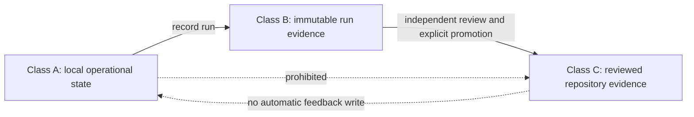

# ADR-0003 — Separate Mutable Operational State from Immutable Evidence

- **Status:** Proposed
- **Date:** 2026-07-20
- **Decision owner:** Architect
- **Implementation authority:** None granted by this record
- **Related work:** P0, P0.1, P0.2 in `taskchain.md`; DT-02 in the obstruction ledger

## Context

The open repository-integrity incident involves tracked `.forensics/last_run_epoch.txt`, a reported writer path in `scripts/git_forensics_autocommit.sh`, cross-worktree `Resource deadlock avoided` behavior, and an unexplained change in the recorded epoch value. The current evidence does not establish malicious activity, but it demonstrates that one tracked path has been serving two incompatible purposes:

1. mutable operational state expected to change when automation runs; and
2. repository evidence expected to change only through an intentional, reviewable commit.

Git worktrees may share a common Git directory while retaining separate checked-out trees. A mutable marker that is not explicitly bound to repository identity, worktree identity, process identity, and a lock namespace can create cross-worktree ambiguity. A successful exact-head CI run cannot independently reconstruct or close a local writer-path incident.

## Decision proposal

Adopt a strict three-class state model.

### Class A — Local operational state

Examples: last-run timestamps, current lock ownership, retry counters, temporary process state.

Requirements:

- stored outside tracked product paths or in an explicitly ignored local-state directory;
- bound to repository and worktree identity;
- owner- and path-validated;
- protected by exclusive locking;
- updated by atomic temporary-write, flush, `fsync`, and rename where supported;
- safe under concurrent, interrupted, stale-lock, recursive, wrong-worktree, symlink, read-only, and unauthorized-owner conditions;
- never treated as release evidence by itself.

### Class B — Immutable run evidence

Examples: source commit, script hash, invocation source, process and parent identity, start/end times, result, pre/post hashes, worktree inventory, relevant errors.

Requirements:

- append-only or content-addressed;
- no secret values;
- deterministic manifest and checksum rules;
- explicitly scoped to one run and one repository/worktree identity;
- independently verifiable;
- retained or discarded under a documented evidence policy;
- not automatically committed by the process being investigated.

### Class C — Reviewed repository evidence

Examples: an accepted incident report, remediation design, independently verified replay record, or approved release evidence manifest.

Requirements:

- promoted from Class B through an explicit review step;
- intentionally committed or retained as an immutable reviewed artifact;
- tied to exact source identities and reviewer decisions;
- includes limitations, residual risk, invalidation conditions, and rollback;
- cannot be rewritten by routine automation.

## State promotion

There is no implicit promotion from local state to canonical evidence. There is no automatic write from accepted evidence back into operational state.

## Consequences

### Positive

- normal automation no longer resembles an unexplained repository mutation;
- worktree and lock identity become testable;
- incident evidence can be preserved without timestamp churn;
- exact-head build evidence remains distinguishable from local incident evidence;
- rollback can restore the last reviewed repository state without reconstructing routine run markers;
- the same state/evidence distinction can be reused by future temporal validation and A.L.I.S.T.A.I.R.E. evidence contracts.

### Costs

- a local-state directory and evidence-retention policy must be designed;
- migration must preserve the current tracked marker as incident evidence before changing behavior;
- concurrency, atomicity, ownership, symlink, and cross-worktree fixtures are required;
- operators need clear commands for inspection, cleanup, and recovery;
- evidence artifacts may require storage and retention limits.

## Alternatives considered

### Keep the tracked timestamp and commit every change

Rejected as a default because routine execution changes candidate identity, creates commit churn, and cannot distinguish benign operation from unauthorized invocation without additional evidence.

### Keep the tracked timestamp but do not commit changes

Rejected because the live worktree remains dirty and provenance remains ambiguous.

### Store only logs

Insufficient because logs may be partial, mutable, unbound to exact source/worktree identity, or unavailable after interruption.

### Disable all forensic automation permanently

Retained as a containment option, not a complete design. It prevents further runs but does not define a safe future state/evidence model.

## Acceptance criteria

This ADR may be accepted only after:

- current and committed marker values, metadata, and hashes are preserved;
- writer and invocation-path evidence is captured;
- a proposed state path and evidence path pass path-escape and symlink review;
- repository/worktree identity binding is specified;
- locking and atomicity behavior is specified for supported platforms;
- deterministic concurrent, interrupted, stale-lock, recursive, wrong-worktree, shared-`.git`, unauthorized-owner, symlink, and read-only fixtures are approved;
- independent replay confirms the repair;
- incident closure is explicitly approved.

## Rollback

If the new state/evidence model fails, stop the writer, preserve all new evidence, restore the last reviewed repository commit, keep mutable state disabled, and return P0.1 to `BLOCKED`. Do not restore automatic commits or tracked run-state mutation as an emergency shortcut.
