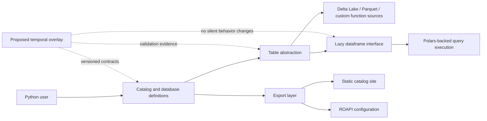
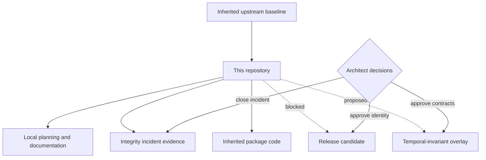

# Repository Project Guide

## Status at a glance

`datarepo-temporal-invariants` currently contains an inherited `data-repository` 0.0.2 codebase plus local planning, release, deployment, and incident records. It is **not** an approved release, maintained fork, renamed derivative, or implemented temporal-invariant product.

The active priority is repository-integrity containment and verification. The tracked mutation of `.forensics/last_run_epoch.txt` remains an open suspected integrity incident until its writer, invocation path, worktree behavior, and evidence chain are independently established. Malicious activity has not been proven.

| Area | Current state |
|---|---|
| Inherited package | Present as `data-repository` 0.0.2 |
| Repository identity | Awaiting mirror/fork/overlay/derivative decision |
| Temporal-invariant capability | Proposed only; no approved executable overlay |
| Repository-integrity incident | Open and release-blocking |
| Build/test/security evidence | Not accepted for the current candidate |
| Packaging or publication | Prohibited until release gates pass |
| Documentation site | Suitable for local review only; publication remains blocked |

## Purpose

This repository is being evaluated as a possible home for a schema-first temporal-invariant overlay on top of the inherited `datarepo` package. The inherited package provides declarative catalogs, database and table abstractions, lazy query execution, and static-site or read-only API export paths.

The prospective local overlay would add explicit, versioned contracts for temporal claims without silently changing inherited behavior. That future work remains gated behind:

1. closure of the repository-integrity incident;
2. approval of repository identity and publication ownership;
3. reproduction of the inherited baseline;
4. approval of temporal semantics, compatibility, migration, fixtures, and rollback.

## Product boundaries

### In scope now

- preserve the inherited package and its attribution;
- document the current architecture and provenance boundary;
- contain and investigate mutable forensic state;
- establish an incident-safe contributor workflow;
- define the design envelope for a possible future temporal overlay;
- retain release, rollback, and verification requirements.

### Not in scope now

- publishing under the inherited package identity;
- claiming ownership of upstream behavior;
- changing query semantics or storage adapters;
- adding an executable temporal validator before contract approval;
- enabling automatic writes, hooks, schedulers, or cross-worktree mutation;
- presenting incident observations as proof of malicious activity;
- marking build, test, security, or release gates as passed without evidence.

## System context

Solid lines describe the inherited package model documented in the existing user guide. Dashed lines describe a possible future overlay and do not represent implemented behavior.

## Repository authority model

The local planning files may describe future work, but they do not retroactively convert inherited code into accepted local product work.

## Architecture layers

| Layer | Responsibility | Current authority |
|---|---|---|
| Catalog | Groups databases and exposes named data domains | Inherited |
| Database | Resolves tables from Python modules or compatible providers | Inherited |
| Table | Declares schema, filters, metadata, partitions, and source-specific reads | Inherited |
| Lazy dataframe | Provides composable query operations over Polars lazy frames | Inherited |
| Export | Produces a static catalog and ROAPI configuration | Inherited |
| Temporal contracts | Would define versioned temporal assertions and validation outputs | Proposed, not implemented |
| Integrity controls | Preserve evidence and prevent unsafe mutable-state behavior | Local, incomplete |
| Release controls | Gate publication on provenance, tests, security, artifacts, and approval | Local, blocked |

## Delivery phases

### P0 — Restore repository trust

Preserve incident evidence, identify the writer and invocation path, disable unsafe mutation, repair state handling, and complete independent replay.

### P1 — Approve repository identity

Choose and document one model: upstream mirror, maintained fork, documentation-only overlay, or renamed derivative. Record exact upstream baseline, local divergence, naming, license/notices, ownership, and publication target.

### P2 — Reproduce the inherited baseline

From a clean immutable commit, reproduce installation, complete tests, formatting, lint, typing, documentation, smoke checks, dependency review, security review, and provenance.

### P3 — Approve temporal contracts

Define users, problems, inputs, outputs, canonical semantics, time model, compatibility, migrations, non-goals, fixtures, threat model, and rollback before implementation.

### P4 — Implement separately

Only after approval, add versioned schemas and validators without silently modifying inherited interfaces or claiming unverified compatibility.

## Release posture

No tag, package, documentation deployment, registry publication, workflow activation, or downstream pin is authorized while `release.md` is blocked. Documentation improvements are review artifacts, not evidence that the inherited package or future overlay is releasable.

## Documentation map

- [Upstream-oriented package overview](README.md)
- [Inherited user guide](user-guide.md)
- [API reference entry points](api-docs.md)
- [Architecture and trust boundaries](architecture.md)
- [Developer onboarding](developer-guide.md)
- [Repository-integrity operations](repository-integrity.md)
- [Proposed temporal-overlay design envelope](temporal-overlay-design.md)
- [Task chain](../taskchain.md)
- [Release plan](../release.md)
- [Deployment record](../deploy.md)
- [Changelog](../changelog.md)
- [Open incident record](../SECURITY_INCIDENT_2026-07-17.md)
