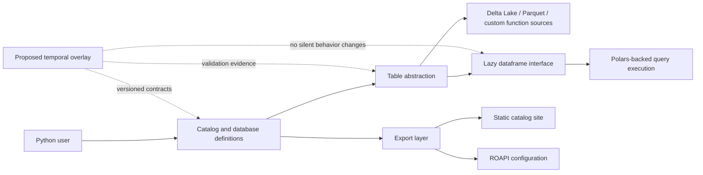
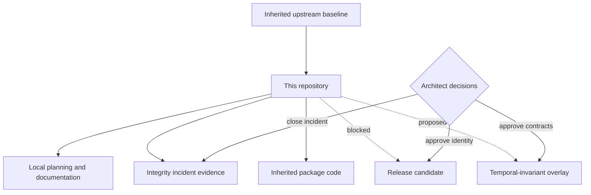

# Repository Project Guide

## Status at a glance

`datarepo-temporal-invariants` currently contains an inherited `data-repository` 0.0.2 codebase plus local planning, release, deployment, and incident records. It is **not** an approved release, maintained fork, renamed derivative, or implemented temporal-invariant product.

The active priority is repository-integrity containment and verification. The tracked mutation of `.forensics/last_run_epoch.txt` remains an open suspected integrity incident until its writer, invocation path, worktree behavior, and evidence chain are independently established. Malicious activity has not been proven.

| Area | Current state |
|---|---|
| Inherited package | Present as `data-repository` 0.0.2 |
| Repository identity | Awaiting mirror/fork/overlay/derivative decision |
| Temporal-invariant capability | Proposed only; no approved executable overlay |
| Repository-integrity incident | Open and release-blocking |
| Material obstruction | Mutable operational state and tracked evidence share an incompatible path/meaning |
| Build/test/security evidence | Not accepted for the current candidate |
| Packaging or publication | Prohibited until release gates pass |
| Documentation site | Suitable for local review only; publication remains blocked |

## Purpose

This repository is being evaluated as a possible home for a schema-first temporal-invariant overlay on top of the inherited `datarepo` package. The inherited package provides declarative catalogs, database and table abstractions, lazy query execution, and static-site or read-only API export paths.

The prospective local overlay would add explicit, versioned contracts for temporal claims without silently changing inherited behavior. That future work remains gated behind:

1. closure of the repository-integrity incident;
2. approval of repository identity and publication ownership;
3. reproduction of the inherited baseline;
4. approval of temporal semantics, compatibility, migration, fixtures, and rollback;
5. approval of cross-repository identity, capability, evidence, display, revocation, and recovery contracts.

## Product boundaries

### In scope now

- preserve the inherited package and its attribution;
- document the current architecture and provenance boundary;
- contain and investigate mutable forensic state;
- establish an incident-safe contributor workflow;
- define the design envelope for a possible future temporal overlay;
- analyze pairwise and triple-overlap integration obstructions;
- retain release, rollback, and verification requirements.

### Not in scope now

- publishing under the inherited package identity;
- claiming ownership of upstream behavior;
- changing query semantics or storage adapters;
- adding an executable temporal validator before contract approval;
- enabling automatic writes, hooks, schedulers, or cross-worktree mutation;
- treating a temporal validation result as authorization to mutate, deploy, publish, or pay;
- presenting incident observations as proof of malicious activity;
- marking build, test, security, or release gates as passed without evidence.

## Material obstruction

The strongest current gluing failure is that `.forensics/last_run_epoch.txt` has been treated as both mutable operational state and tracked repository evidence. Those meanings are incompatible at one automatically written tracked path:

- operational state is expected to change during normal runs;
- tracked evidence is expected to change only through intentional, reviewable repository updates.

As a result, a benign automation run can resemble an unauthorized repository mutation until writer identity, invocation path, worktree identity, locks, and evidence are reconstructed. The proposed repair is documented in [ADR-0003](decisions/0003-separate-operational-state-from-evidence.md): separate worktree-bound local state, immutable run evidence, and explicitly reviewed repository evidence. The ADR is proposed only; it does not implement or approve remediation.

See [Obstruction and Gluing Analysis](obstruction-and-gluing.md) for the complete ledger, contract-edge matrix, triple-overlap fixtures, and repair sequence.

## System context

Solid lines describe the inherited package model documented in the existing user guide. Dashed lines describe a possible future overlay and do not represent implemented behavior.

## Repository authority model

The local planning files may describe future work, but they do not retroactively convert inherited code into accepted local product work.

## Architecture layers

| Layer | Responsibility | Current authority |
|---|---|---|
| Catalog | Groups databases and exposes named data domains | Inherited |
| Database | Resolves tables from Python modules or compatible providers | Inherited |
| Table | Declares schema, filters, metadata, partitions, and source-specific reads | Inherited |
| Lazy dataframe | Provides composable query operations over Polars lazy frames | Inherited |
| Export | Produces a static catalog and ROAPI configuration | Inherited |
| Temporal contracts | Would define versioned temporal assertions and validation outputs | Proposed, not implemented |
| Integrity controls | Preserve evidence and prevent unsafe mutable-state behavior | Local, incomplete |
| Release controls | Gate publication on provenance, tests, security, artifacts, and approval | Local, blocked |
| Portfolio gluing | Would connect Seeker records, capabilities, temporal evidence, Bridge, interfaces, and policy decisions | Proposed, owners unresolved |

## Documentation authority

Documentation uses explicit maturity classes so inherited capabilities, preserved observations, local configuration, proposed design, test evidence, independent verification, and approval are not conflated. `taskchain.md` governs sequencing, `release.md` governs eligibility, accepted ADRs govern durable architecture decisions, and the changelog records history. Pages content is explanatory and cannot override those records.

The current documentation package adds review material only. It does not:

- close the suspected repository-integrity incident;
- approve a repository or package identity;
- verify the inherited package baseline;
- accept temporal schemas or semantics;
- approve Repository `1` or another capability issuer;
- authorize remote observations, Pages publication, or package publication.

See [Authority and claims governance](authority-and-claims.md) for the complete vocabulary and publication stop rules.

## Delivery phases

### P0 — Restore repository trust

Preserve incident evidence, identify the writer and invocation path, disable unsafe mutation, repair state handling, and complete independent replay.

### P1 — Approve repository identity

Choose and document one model: upstream mirror, maintained fork, documentation-only overlay, or renamed derivative. Record exact upstream baseline, local divergence, naming, license/notices, ownership, and publication target.

### P2 — Reproduce the inherited baseline

From a clean immutable commit, reproduce installation, complete tests, formatting, lint, typing, documentation, smoke checks, dependency review, security review, and provenance.

### P3 — Approve temporal contracts

Define users, problems, inputs, outputs, canonical semantics, time model, compatibility, migrations, non-goals, fixtures, threat model, and rollback before implementation.

### P3G — Approve cross-repository gluing

Assign owners and versioned contracts for source observations, subject identity, capability issuance, temporal results, evidence transport, human display, correction/revocation, policy decisions, emergency stop, and recovery. Prove pairwise and triple-overlap behavior with fail-closed fixtures.

### P4 — Implement separately

Only after approval, add versioned schemas and validators without silently modifying inherited interfaces or claiming unverified compatibility.

## Reviewable architecture decisions

Three proposed ADRs turn major unresolved choices into explicit review records:

- [ADR-0001: Repository identity and publication authority](decisions/0001-repository-identity.md) compares mirror, maintained-fork, documentation-only, and renamed-derivative models. It remains blocked by incident closure.
- [ADR-0002: Isolate temporal validation from inherited query behavior](decisions/0002-temporal-overlay-isolation.md) proposes an additive, explicit, read-only validation boundary. It remains dependent on identity and contract approval.
- [ADR-0003: Separate mutable operational state from immutable evidence](decisions/0003-separate-operational-state-from-evidence.md) proposes local operational state, immutable run evidence, and reviewed repository evidence as separate classes. It remains dependent on preserved incident evidence, implementation fixtures, independent replay, and explicit approval.

None of these ADRs grants implementation authority.

## Release posture

No tag, package, documentation deployment, registry publication, workflow activation, or downstream pin is authorized while `release.md` is blocked. Documentation improvements are review artifacts, not evidence that the inherited package or future overlay is releasable.

The [release evidence matrix](release-evidence.md) maps each gate to the immutable records required for acceptance and keeps documentation verification distinct from runtime, incident, temporal, deployment, and release approval.

## Documentation map

### Local project and governance

- [Repository project guide](project-guide.md)
- [Architecture and trust boundaries](architecture.md)
- [Obstruction and gluing analysis](obstruction-and-gluing.md)
- [Authority and claims governance](authority-and-claims.md)
- [API and extension boundaries](api-and-extension-boundaries.md)
- [Developer onboarding](developer-guide.md)
- [Repository-integrity operations](repository-integrity.md)
- [Release evidence and verification](release-evidence.md)
- [Proposed temporal-overlay design envelope](temporal-overlay-design.md)
- [ADR-0001: Repository identity](decisions/0001-repository-identity.md)
- [ADR-0002: Temporal-overlay isolation](decisions/0002-temporal-overlay-isolation.md)
- [ADR-0003: Operational state and evidence separation](decisions/0003-separate-operational-state-from-evidence.md)

### Inherited package material

- [Upstream-oriented package overview](README.md)
- [Inherited user guide](user-guide.md)
- [Inherited API reference entry points](api-docs.md)

### Repository control records

- [Task chain](https://github.com/aevespers2/datarepo-temporal-invariants/blob/main/taskchain.md)
- [Punch list](https://github.com/aevespers2/datarepo-temporal-invariants/blob/main/punchlist.md)
- [Release plan](https://github.com/aevespers2/datarepo-temporal-invariants/blob/main/release.md)
- [Deployment record](https://github.com/aevespers2/datarepo-temporal-invariants/blob/main/deploy.md)
- [Changelog](https://github.com/aevespers2/datarepo-temporal-invariants/blob/main/changelog.md)
- [Open incident record](https://github.com/aevespers2/datarepo-temporal-invariants/blob/main/SECURITY_INCIDENT_2026-07-17.md)
