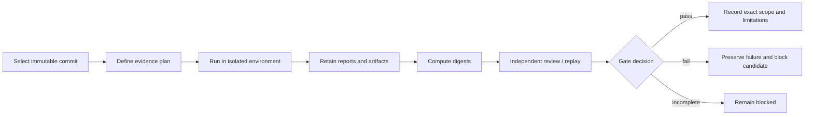

# Release Evidence and Verification Matrix

## Current posture

Release status remains **`BLOCKED — OPEN REPOSITORY-INTEGRITY INCIDENT`**.

This page explains how documentation, incident evidence, inherited-package verification, optional temporal-overlay evidence, and publication approval fit together. It does not mark any acceptance gate passed and does not replace `release.md`.

## Candidate identity

Several immutable identities may exist at the same time and must not be conflated:

| Identity | Purpose | Current meaning |
|---|---|---|
| Inherited upstream baseline | Source lineage for `data-repository` 0.0.2 | Exact approved upstream commit still requires provenance review |
| Incident evidence commit | Preserves the repository state associated with the tracked forensic marker issue | Security evidence, not a product release |
| Documentation PR head | Contains review-only Pages and developer documentation | Documentation candidate only |
| Future baseline-reproduction head | Candidate at which inherited build/test/static/security evidence is collected | Does not yet exist as an accepted candidate |
| Future temporal-overlay head | Candidate containing approved schemas or validators | Not authorized and not implemented |
| Release tag/artifact | Approved distributable output | Prohibited while blocking gates remain |

A documentation build at the documentation PR head cannot satisfy inherited runtime, security, temporal determinism, packaging, or release approval gates.

## Evidence lifecycle



Evidence is accepted only for the named commit, environment, command set, and artifact set. A later commit requires re-evaluation of affected gates.

## Minimum evidence record

Each retained check should record:

- repository and immutable commit SHA;
- branch or PR only as navigation, not identity;
- date and execution environment;
- operating system, architecture, Python, package manager, and dependency lock facts;
- exact command and configuration;
- network, credential, filesystem, and permission assumptions;
- result status and exit code;
- complete or bounded logs;
- report and artifact paths;
- SHA-256 digests;
- reviewer identity and review date;
- known limitations, exclusions, and residual risk;
- rollback or containment action for failures.

## Gate-to-artifact matrix

| Gate | Required artifact or record | Current status |
|---|---|---|
| Incident evidence preservation | Binary-safe copies, metadata, hashes, refs, worktree state, hooks, schedulers, script identity, logs | Incomplete / incident open |
| Incident containment | Record showing unsafe tracked-state writes are disabled and evidence remains unchanged | Fail |
| Root-cause determination | Hypothesis table identifying the writer and invocation path with evidence | Fail |
| State-writer repair | Patch, design, tests, and review for out-of-tree or ignored state plus atomic worktree-bound locking | Blocked behind evidence capture |
| Independent incident validation | Reproduction and replay report from a separate inspector | Blocked |
| Repository identity | Approved ADR, exact upstream baseline, divergence, naming, ownership, license/notices, publication target | Blocked |
| Inherited install/build | Clean isolated installation transcript and artifacts | No current accepted evidence |
| Tests | Complete test report at one immutable candidate | No current accepted evidence |
| Formatting/lint/typing | Tool versions, commands, and reports | No current accepted evidence |
| Documentation build | Strict build, link check, diagram review, artifact digest | Pending for documentation candidate |
| Dependency/security review | Dependency inventory, advisory scan, secrets review, parser/filesystem/network/CI review | Fail / incomplete |
| Repository health | Branch, workflow, dependency, ownership, licensing, maintenance, and release-control review | Missing |
| Provenance | Upstream/local history, source archive, SBOM, checksums, attestations, reviewer record | Fail |
| Temporal contracts | Approved schemas, semantics, canonicalization, compatibility, migration, fixtures | Not included |
| Temporal determinism | Replayable positive/negative/adversarial fixtures and stable hashes | Not included |
| Deployment | Environment, artifact, permissions, observability, rollback rehearsal, approval | Blocked |
| Release approval | Explicit human approval after every blocking gate passes | Pending |

## Incident evidence bundle

The incident evidence bundle should be immutable and access-controlled. At minimum it should include:

1. committed and observed copies of `.forensics/last_run_epoch.txt`;
2. file size, mode, ownership, timestamps, inode or platform-equivalent metadata, and SHA-256 digests;
3. binary-safe diff and interpretation of the epoch values without normalizing them;
4. the exact `scripts/git_forensics_autocommit.sh` content and digest, if present in the candidate;
5. related hooks, aliases, task-runner entries, cron or scheduler definitions, service definitions, CI workflows, and process evidence;
6. `git status --porcelain=v2 --branch`, refs, reflogs, remotes, worktree inventory, relevant Git configuration, and shared-`.git` facts;
7. lockfiles, temporary files, error logs, and the preserved `Resource deadlock avoided` observation;
8. credential and account audit evidence where available, without copying secret values;
9. a hypothesis-disposition table covering benign automation, lock contention, recursion, wrong-worktree execution, unauthorized invocation, hook/scheduler misuse, and altered provenance;
10. containment, repair, independent replay, residual-risk, and explicit closure records.

## Documentation candidate verification

Before this documentation PR is considered review-ready, retain:

- exact PR head SHA;
- dependency installation method for documentation tooling;
- `mkdocs build --strict` command and result;
- generated-site artifact and SHA-256 digest;
- internal link and anchor validation;
- Mermaid rendering or syntax review;
- check for missing images, scripts, stylesheets, and inherited example assets;
- review of inherited `site_url`, repository URL, package links, and branding;
- accessibility review for headings, alt text, code blocks, tables, keyboard navigation, and color-independent meaning;
- privacy and secret scan of generated output;
- confirmation that proposed features are not described as implemented;
- confirmation that no Pages deployment was performed.

Passing this list improves the documentation gate only. It does not close the incident or authorize release.

## Inherited baseline reproduction

After incident closure and identity approval, P2 evidence should be collected from a clean checkout with no mutable local state. The record should include:

```text
immutable source commit
clean checkout verification
isolated environment creation
package-manager and lockfile resolution
build and installation
complete tests
format, lint, and type checks
documentation build
minimal catalog/query/export smoke checks
dependency and license inventory
security and secrets review
source archive, sdist, and wheel hashes
SBOM and provenance manifest
independent reproduction
```

Any skipped check must be explicitly justified and may remain release-blocking.

## Temporal-overlay evidence

If P3 is approved and P4 later begins, evidence must additionally cover:

- versioned contract and result schemas;
- canonical parser and serializer behavior;
- time, ordering, missing-data, and uncertainty semantics;
- deterministic identifiers and hashes;
- compatibility and migration matrices;
- positive, negative, adversarial, and replay fixtures;
- resource-limit enforcement;
- untrusted-input handling;
- absence of implicit writes, network access, code execution, publication, or enforcement;
- isolation from inherited query behavior;
- clean removal and rollback to the exact inherited baseline.

## Publication evidence

Documentation or package publication requires a distinct approval record. The publication bundle should name:

- approved repository and package identity;
- target environment, registry, or Pages site;
- immutable source and artifact digests;
- license, notices, attribution, and ownership;
- privacy and content review;
- dependency, security, and supply-chain results;
- deployment command or workflow;
- least-privilege credentials and environment controls;
- health checks and observability;
- rollback target and rehearsal evidence;
- approving authority.

The existence of upstream links or inherited deployment configuration is not local publication authority.

## Evidence invalidation rules

Re-run affected gates when:

- source, tests, dependencies, build configuration, workflows, or documentation change;
- incident evidence changes unexpectedly;
- the upstream baseline or local divergence changes;
- package or repository identity changes;
- contract semantics, canonicalization, schemas, adapters, or result formats change;
- artifacts are rebuilt in a materially different environment;
- a security advisory affects the candidate;
- retained hashes do not match;
- a reviewer identifies an undocumented assumption.

## Fail-closed decision rules

A gate remains blocked when evidence is missing, stale, mutable, irreproducible, scoped to another commit, or inconsistent with higher-authority records. Unknown, skipped, indeterminate, and partially reviewed states do not become a pass.

Immediately reject or withdraw a candidate if:

- forensic state changes without an identified authorized writer;
- evidence hashes differ;
- cross-worktree, recursion, symlink, path-escape, ownership, or atomicity failures recur;
- inherited and local provenance cannot be separated;
- generated documentation materially misstates authority or capability;
- secrets or sensitive evidence appear in artifacts;
- temporal validation accepts invalid state or behaves non-deterministically;
- published artifacts differ from approved digests.

## Review record template

```markdown
# Evidence Record

- Repository:
- Immutable commit:
- Purpose:
- Gate:
- Date:
- Executor:
- Reviewer:
- Environment:
- Network/credential assumptions:
- Commands:
- Result:
- Exit code:
- Reports/artifacts:
- SHA-256 digests:
- Limitations:
- Residual risk:
- Rollback/containment:
- Decision: PASS | FAIL | INCOMPLETE | NOT APPLICABLE
- Approval reference:
```

Use one record per independently reviewable gate. Do not combine unrelated failures into a narrative that obscures which evidence supports which decision.
