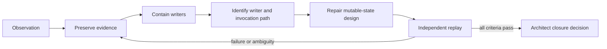
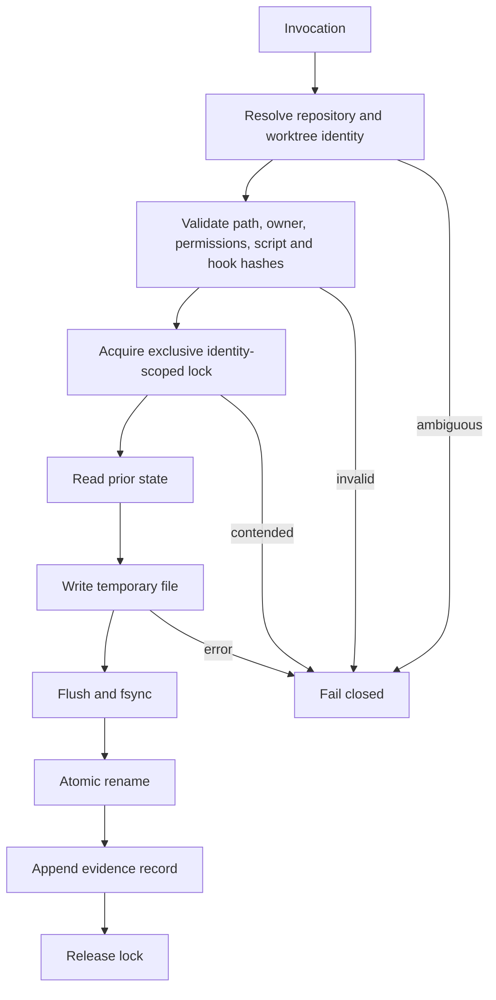

# Repository-Integrity Operations

## Purpose

This playbook converts the open forensic-epoch incident requirements into a bounded operator sequence. It supplements `SECURITY_INCIDENT_2026-07-17.md`; it does not close the incident, identify an actor, or authorize destructive remediation.

## Governing rule

Preserve first, contain second, investigate third, repair fourth, validate independently, and only then request closure.



## Roles

| Role | Responsibility |
|---|---|
| Architect | Defines scope, approves containment, accepts residual risk, and closes or continues the incident |
| Inspector | Captures evidence, tests competing hypotheses, and independently replays the repaired path |
| Builder | Implements only the approved state-handling repair and fixtures |
| Repository owner | Reviews account, token, deploy-key, branch, workflow, and audit evidence available through GitHub |

A single person may perform multiple roles, but the independent replay must be clearly separated from the repair evidence.

## Phase 1 — Preserve

Capture without editing the affected files:

```bash
umask 077
mkdir -p "$HOME/datarepo-incident-evidence"
EVIDENCE="$HOME/datarepo-incident-evidence/$(date -u +%Y%m%dT%H%M%SZ)"
mkdir -p "$EVIDENCE"

git status --porcelain=v2 --branch > "$EVIDENCE/git-status.txt"
git diff --binary -- .forensics/last_run_epoch.txt > "$EVIDENCE/marker.diff"
git show HEAD:.forensics/last_run_epoch.txt > "$EVIDENCE/marker.committed.txt"
cp -p .forensics/last_run_epoch.txt "$EVIDENCE/marker.observed.txt"
git worktree list --porcelain > "$EVIDENCE/worktrees.txt"
git reflog --all --date=iso-strict > "$EVIDENCE/reflog.txt"
git remote -v > "$EVIDENCE/remotes.txt"
git config --show-origin --get-regexp 'core\.hooksPath|include|credential|url\..*\.insteadOf' \
  > "$EVIDENCE/git-config-sensitive.txt" 2>&1 || true
find "$EVIDENCE" -type f -exec shasum -a 256 {} \; | sort > "$EVIDENCE/SHA256SUMS"
```

Also preserve file metadata, relevant scripts, hook directories, scheduler definitions, process listings, IDE/task-runner configuration, logs, refs, recent commits, signatures, and account audit information where available.

Do not place secrets into the repository evidence bundle. Record the existence, scope, identifier, and review result of credentials without copying secret values.

## Phase 2 — Contain

- stop scheduled, hooked, IDE-triggered, launch-agent, cron, or manual execution of the reported writer;
- prevent further tracked writes under `.forensics/`;
- do not delete the script, marker, logs, or lock artifacts before preservation;
- do not rotate credentials unless evidence establishes a credential-related trigger or containment need;
- avoid working in multiple linked worktrees until identity and lock behavior are understood;
- do not publish, tag, deploy, or activate workflows.

Record every containment action, operator, time, affected path/process, and rollback method.

## Phase 3 — Hypothesis testing

| Hypothesis | Minimum evidence |
|---|---|
| Expected automation churn | authorized scheduler/task definition, execution logs, matching process identity, expected worktree, expected timestamp transition |
| Lock contention or recursion | reproducible concurrent/recursive invocation and matching deadlock/error behavior |
| Cross-worktree contamination | path-resolution trace demonstrating a write to a different worktree or shared state path |
| Unauthorized local invocation | process, shell, IDE, scheduler, account, or filesystem evidence tying execution to an unapproved source |
| Hook misuse | repository/global hook contents, hashes, configuration origin, and invocation evidence |
| Credential or remote misuse | unexplained refs, commits, deploy keys, tokens, sessions, workflow runs, or audit events |
| False provenance | inconsistent hashes, metadata, timestamps, logs, commit claims, or evidence-chain gaps |
| Tool defect | code review and deterministic fixture reproducing non-atomic, unlocked, path-ambiguous, or recursive behavior |

Classify each hypothesis as supported, contradicted, inconclusive, or not testable, with evidence references. Do not collapse “inconclusive” into “benign” or “malicious.”

## Phase 4 — Required repair design

Mutable state should live outside tracked product paths and be bound to explicit repository identity.



The repair must:

- store run epochs and locks outside the repository or in an explicitly ignored local state directory;
- never auto-commit session state;
- bind locks and state to both repository identity and worktree path;
- reject symlinks, traversal, unexpected ownership, and unauthorized paths;
- use exclusive locking, temporary writes, flush/`fsync`, and atomic rename;
- fail closed without recursive retry or cross-worktree fallback;
- append start/end timestamps, process identity, worktree identity, script hash, prior/new hashes, outcome, and errors.

## Phase 5 — Verification matrix

| Fixture | Expected result |
|---|---|
| Two concurrent writers | one succeeds; the other fails closed without mutation |
| Stale lock | deterministic, authorized recovery with evidence |
| Interrupted write | prior valid state remains intact |
| Recursive invocation | inner invocation is rejected |
| Wrong worktree root | no write occurs |
| Shared `.git` with multiple worktrees | state and locks remain isolated |
| Symlinked state path | rejected before write |
| Unauthorized owner/permissions | rejected and logged |
| Missing state directory | created only at the approved out-of-tree location, or fails closed |
| Read-only worktree | no product-path mutation |
| Changed script hash | rejected or explicitly re-approved |
| Changed hook configuration | detected and surfaced |

Retain command lines, environments, exit codes, logs, output files, and hashes for each fixture.

## Independent validation

The Inspector should start from the preserved failure description, reproduce the unsafe behavior where possible in an isolated fixture repository, then verify the repair without relying on the Builder's conclusions. Validation must include repository and worktree identity, evidence-hash verification, negative tests, interruption tests, and a check for unexplained mutation.

## Closure packet

The Architect requires:

- preserved original and observed marker evidence;
- writer and invocation-path determination;
- hypothesis disposition table;
- containment record;
- repair design and reviewed patch;
- complete fixture results;
- independent replay report;
- repository/account integrity review;
- residual-risk statement;
- tested rollback instructions;
- explicit closure decision and date.

Until that packet is accepted, `taskchain.md`, `release.md`, and `deploy.md` remain blocked.

## Rollback

If the repair introduces new writes, loses evidence, permits ambiguous identity, fails concurrency or interruption tests, or changes inherited product behavior, stop the writer, preserve the new evidence, revert only the repair commits, and restore the last independently verified state. Do not rewrite incident history or delete failed evidence.
