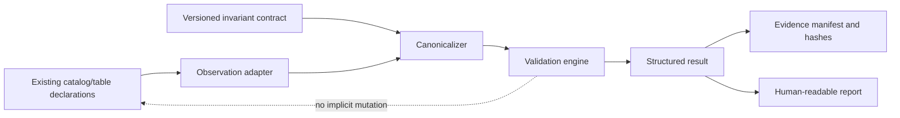
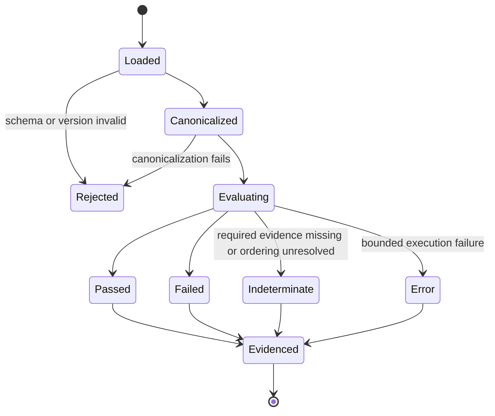

# Proposed Temporal-Invariant Overlay

## Status

**Design envelope only — not approved, implemented, packaged, or released.**

This document translates P3 of `taskchain.md` into a reviewable contract checklist. It deliberately avoids selecting temporal semantics that require architectural approval.

## Problem statement

Data catalogs commonly describe what data exists and how to query it, but they may not express or verify claims about how a dataset, schema, partition, record set, or derived artifact behaves across time. A temporal-invariant overlay could provide explicit, deterministic validation of such claims while preserving the inherited query interfaces.

Examples of claim families that may be considered after approval include:

- schema compatibility across observations;
- monotonic or append-only fields;
- allowed state transitions;
- bounded lateness or freshness;
- stable identity keys;
- partition continuity;
- reproducible derived-state hashes;
- retention or expiry rules.

These are candidate categories, not accepted semantics.

## Design principles

- Additive rather than silently invasive.
- Schema-first and versioned.
- Deterministic for identical canonical inputs.
- Evidence-producing rather than narrative-only.
- Explicit about clocks, ordering, missing data, and uncertainty.
- Compatible with offline validation.
- Safe for untrusted metadata and bounded data samples.
- Reversible to the inherited baseline.

## Proposed component boundary



The overlay should consume declarations and observations through explicit adapters. It should not rewrite source data, modify query plans, publish artifacts, or change inherited package behavior as a side effect of validation.

## Contract envelope

A future contract schema should include at least:

| Field group | Required questions |
|---|---|
| Identity | What uniquely identifies the contract, subject, dataset, table, partition, or derived artifact? |
| Version | Which schema version and semantic version govern interpretation? |
| Time model | Event time, processing time, observation time, commit time, or another declared clock? |
| Ordering | Total order, partial order, causal order, sequence number, or unordered observations? |
| Window | Which observations are compared, and how are boundaries represented? |
| Predicate | What must remain true, and over which fields or states? |
| Missing/late data | Fail, warn, defer, or evaluate under a declared tolerance? |
| Canonicalization | How are schemas, values, timestamps, nulls, floats, paths, and metadata normalized? |
| Severity | Informational, warning, error, or release-blocking? |
| Evidence | Which input hashes, outputs, traces, and environment facts are retained? |
| Compatibility | How do older readers and contracts behave? |
| Migration | How is a subject or contract upgraded and rolled back? |
| Resource bounds | Maximum observations, bytes, recursion, execution time, and external access? |

## Candidate result model

A validation result may eventually contain:

```json
{
  "result_schema": "temporal-invariant-result/v1",
  "contract_id": "example-contract",
  "contract_version": "1.0.0",
  "subject_id": "catalog/database/table",
  "evaluation_id": "deterministic-or-recorded-id",
  "status": "pass | fail | indeterminate | error",
  "observations": [],
  "violations": [],
  "warnings": [],
  "input_hash": "sha256:...",
  "result_hash": "sha256:...",
  "engine_version": "...",
  "environment": {},
  "started_at": "...",
  "completed_at": "..."
}
```

This example establishes shape only. Field names, identifiers, time representation, hashing rules, and status semantics require approval and deterministic fixtures.

## Canonicalization decisions required

Before implementation, approve rules for:

- Unicode normalization and string encoding;
- timestamp format, precision, timezone, leap-second handling, and ambiguous local times;
- numeric representation, decimal precision, NaN/infinity, and signed zero;
- null, missing, unknown, and redacted values;
- schema field ordering and metadata ordering;
- path, URI, and object-store identifier normalization;
- partition ordering and duplicate observations;
- map/set ordering;
- binary data and large-object references;
- canonical serialization and hash algorithm;
- environment facts included in or excluded from deterministic hashes.

## State and evaluation lifecycle



`indeterminate` must remain distinct from `pass`. Missing evidence, unsupported versions, or unresolved ordering may not be silently accepted.

## Compatibility model

The approved model should distinguish:

- **result-schema compatibility:** whether a reader can interpret emitted results;
- **contract-schema compatibility:** whether a validator can load a contract;
- **semantic compatibility:** whether the same contract means the same thing across engine versions;
- **subject compatibility:** whether schema/data changes remain valid under a contract;
- **artifact compatibility:** whether evidence can be independently replayed.

Breaking semantic changes require a new contract or engine major version and migration evidence. Parsers should reject unknown required fields or unsupported major versions rather than guessing.

## Security and privacy model

- Treat contracts, catalog modules, metadata, and observation payloads as untrusted inputs.
- Do not execute arbitrary Python merely to inspect a contract.
- Bound input sizes, recursion, regex behavior, decompression, memory, and evaluation time.
- Avoid including raw sensitive rows in results unless explicitly approved.
- Redact credentials and private endpoints from reports and generated sites.
- Disable network access by default during deterministic validation.
- Require explicit adapters and least-privilege credentials for remote observations.
- Record enough provenance for replay without copying secret material.
- Keep validation separate from enforcement or mutation authority.

## Required fixture families

### Positive

- invariant holds over a minimal ordered sequence;
- equivalent canonical inputs produce identical hashes;
- supported previous minor contract version remains readable;
- missing optional metadata does not change semantics.

### Negative

- prohibited state transition;
- incompatible schema change;
- duplicate or conflicting observation identity;
- out-of-order event outside declared policy;
- unsupported contract major version;
- malformed timestamp or non-canonical value;
- hash mismatch;
- resource limit exceeded.

### Adversarial

- oversized or deeply nested input;
- malicious regex or expression payload;
- path traversal or symlink reference;
- decompression bomb or oversized embedded data;
- NaN/float canonicalization ambiguity;
- Unicode confusable identity;
- hostile custom metadata;
- external reference requiring unauthorized network access.

### Migration and replay

- upgrade contract version and retain expected meaning;
- reject an unapproved breaking migration;
- roll back to the previous contract and reproduce prior result hashes;
- replay a complete evidence bundle in a clean environment.

## Acceptance criteria before implementation

- approved user and problem statement;
- approved time and ordering model;
- versioned contract and result schemas;
- canonical serialization specification;
- compatibility and migration policy;
- complete positive, negative, adversarial, and replay fixtures;
- threat model and resource limits;
- separation from inherited query behavior;
- packaging and namespace decision;
- provenance and artifact format;
- rollback to the inherited baseline;
- explicit `READY` status in `taskchain.md`.

## Rollback model

The first implementation must remain removable as a separate overlay. Rolling back should restore the exact inherited baseline, preserve contracts and results as historical evidence, and avoid migrating source data irreversibly. A rollback is required if canonical outputs are non-deterministic, compatibility is misclassified, invalid states pass, valid historical states fail without an approved breaking change, sensitive data leaks into artifacts, or the overlay modifies inherited behavior unexpectedly.

## Open architectural decisions

- Is the overlay documentation-only, library-only, CLI-enabled, or integrated into catalog export?
- What subject granularity is supported first: catalog, database, table, partition, schema, or artifact?
- Which clock and ordering semantics are mandatory?
- Are predicates declarative only, or may reviewed extension functions be used?
- Which data may be sampled during validation?
- What constitutes a stable subject identity across renames or migrations?
- Which result statuses block release or deployment?
- What package namespace and ownership model apply after the fork decision?
